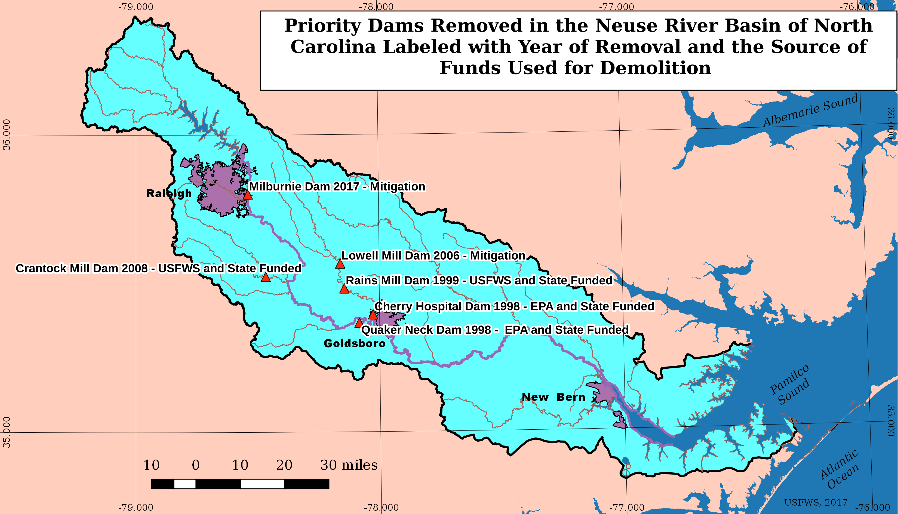

\newpage

```{r setup, include=FALSE}
# Get working directory
getwd()

# Load packages
library(tidyverse)
library(lubridate)
library(dataRetrieval)

# Set ggplot theme
theme_set(theme_bw())

# Possible sites:
# 01631000
# info: https://dwr.virginia.gov/fishing/fish-passage/#orange


# Load datasets
# Download list of available parameters
ShenaParams <- whatNWISdata(siteNumbers = "01631000")
# Download discharge data
ShenaFlow <- readNWISdv(siteNumbers = "01631000",
                    parameterCd = "00060",
                     startDate = "",
                     endDate = "")

# Most common parameters:
# 00095 Specific conductance
# 00010 Temperature C
# 80154 Suspended sediments mg/L
# 00400 pH
# 00900 Hardness - sum of calcium and magnesium. Check time scales of each
# 00660 Orthophosphate mg/L
# 00631 Nitrate mg/L
# 00945 Sulfate, mg/L
# 00925 Magnesium, mg/L
# 00915 Calcium, mg/L

# Download water quality data
ShenaWQ  <- readWQPqw(siteNumbers = "USGS-01631000",
                      parameterCd = c("00631", # nitrate, mg/L
                                      "00660", # phosphate, mg/L
                                      "00915", # calcium, filtered mg/L
                                      "00925", # magnesium, filtered mg/L
                                      "00400", # pH
                                      "80154", # Suspended sediments mg/L
                                      "00095", # Specific conductance
                                      "00900", # Hardness 
                                      "00010"), # Temperature C
                      startDate = "",
                      endDate = )

```


# Rationale and Research Questions

Over the past century, perceptions of dams have gradually changed, as understanding of their serious ecological issues has increased and as existing dams have aged, creating safety concerns and the need for expensive repairs. Dams block the passage of fish and other aquatic species, seriously disrupting life cycles for some species. They also impact water quality and alter natural flow. Increasingly, dam removal is pursued as an option to deal with aging dams and restore rivers. 

In this study, we seek to understand how dam removal has impacted the physical and chemical processes of one river, the Neuse River in North Carolina. Between 1998 and 2017, six dams were removed from the Neuse River (see map below). The gage we are using for these analyses is downstream from Goldsboro and should thus reflect some of the changes in flow and water quality that occurred after these removals.  



We are interested in both changes in physical process and changes in chemical processes, which can vary widely according to the specific river, its history, and the dam removal process (Foley et al 2017). Dams allow for moderation of flow, often eliminating extreme flooding events. Therefore, dam removal in combination with increasing extreme weather events due to climate change could lead to more extreme and more frequent high flow events. On the other hand, natural river systems and riparian areas can be more resilient to flood events than artificially constructed channels, so true restoration could help mitigate high flow events to some extent. 

Changes in water quality are also an area of interest. Large amounts of sediment and minerals built up behind the dam may release quickly after removal, especially if the removal was sudden rather than gradual (Foley et al 2017). Over longer time, water quality is expected to improve because of restored ecological processes.

## Question 1: Have discharge levels become more extreme since dam removal?

## Question 2: Has there been an increase in release of sediment and nutrients over time? 
#+ Have levels steadily increased since dam removal, or did they spike and then stabilize?


\newpage

# Dataset Information

```{r wrangling}
# Change column names
names(ShenaFlow)[4:5] <- c("Discharge", "Approval.Code")
# Check dimensions
dim(ShenaFlow)
# Check Flow data formats
str(ShenaFlow)
# Check Flow data summary
summary(ShenaFlow)

# Convert WQ to wider dataframe with characteristics of interest
ShenaWQ_processed <- ShenaWQ %>%
  select(MonitoringLocationIdentifier, ActivityStartDate, HydrologicCondition, 
         CharacteristicName, ResultMeasureValue) %>%
  mutate(Variable = case_when(CharacteristicName == "pH" ~ "pH", 
                              CharacteristicName == "Hardness, Ca, Mg" ~ "Hardness",
                              CharacteristicName == "Specific conductance" ~ "SpC_uS.cm",
                              CharacteristicName == "Calcium" ~ "Calcium_mg.L",
                              CharacteristicName == "Magnesium" ~ "Magnesium_mg.L",
                              CharacteristicName == "Suspended Sediment Concentration (SSC)" ~ "Sediments_mg.L",
                              CharacteristicName == "Inorganic nitrogen (nitrate and nitrite)" ~ "Nitrogen_mg.L",
                              CharacteristicName == "Orthophosphate" ~ "Phosphate_mg.L",
                              CharacteristicName == "Temperature, water" ~ "Temp_C")) %>%
  select(-CharacteristicName) %>%
  pivot_wider(names_from = "Variable", values_from = "ResultMeasureValue") %>%
  unnest(Calcium_mg.L:Sediments_mg.L)

# Rename the date column
names(ShenaWQ_processed)[2] <- "Date"

# Check the dimensions
dim(ShenaWQ_processed)
# Check the summary
summary(ShenaWQ_processed)
# Check WQ data formats
str(ShenaWQ_processed)

```

\newpage

# Exploratory Analysis 

```{r}
# View flow over time
ggplot(ShenaFlow, aes(x = Date, y = Discharge)) +
  geom_line() 

# View pH over time
ggplot(ShenaWQ_processed, aes(x = Date, y = pH)) +
  geom_point()
# View Calcium over time
ggplot(ShenaWQ_processed, aes(x = Date, y = Calcium_mg.L)) +
  geom_point() # REMOVE
# View Magnesium over time
ggplot(ShenaWQ_processed, aes(x = Date, y = Magnesium_mg.L)) +
  geom_point() # REMOVE
# View Nitrogen over time
ggplot(ShenaWQ_processed, aes(x = Date, y = Nitrogen_mg.L)) +
  geom_point()
# View Phosphate over time
ggplot(ShenaWQ_processed, aes(x = Date, y = Phosphate_mg.L)) +
  geom_point()
# View Special Conductance over time
ggplot(ShenaWQ_processed, aes(x = Date, y = SpC_uS.cm)) +
  geom_point()
# View Hardness over time
ggplot(ShenaWQ_processed, aes(x = Date, y = Hardness)) +
  geom_point()
# View Temp over time
ggplot(ShenaWQ_processed, aes(x = Date, y = Temp_C)) +
  geom_point()
# View Sediments over time
ggplot(ShenaWQ_processed, aes(x = Date, y = Sediments_mg.L)) +
  geom_point()

# Remove Calcium and Magnesium because they don't have data post-2004
ShenaWQ_processed <- ShenaWQ_processed %>%
  select(-Calcium_mg.L, -Magnesium_mg.L)

# TO DO
# Create a month column to be able to color by month
# Pick and run analyses

```


\newpage

# Analysis

```{r}

```


\newpage

# Summary and Conclusions


\newpage

# References

* Foley, M. M., J. R. Bellmore, J. E. O'Connor, J. J. Duda, A. E. East, G. E. Grant, C. W. Anderson, J. A. Bountry, M. J. Collins, P. J. Connolly, L. S. Craig, J. E. Evans, S. L. Greene,F. J. Magilligan, C. S. Magirl, J. J. Major, G. R. Pess,T. J. Randle, P. B. Shafroth, C. E. Torgersen, D. Tullos, A. C. Wilcox. 2017. Dam removal: Listening in. Water Resources Research. 53(7):5229-5246. https://doi-org.proxy.lib.duke.edu/10.1002/2017WR020457

