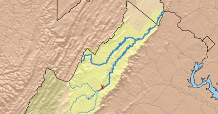

\newpage

```{r setup, include=FALSE}
# Get working directory
getwd()

# Load packages
library(tidyverse)
library(lubridate)
library(dataRetrieval)
library(mcp)
library(psych)
library(trend)
library(knitr)
library(summarytools)

# Set ggplot theme
theme_set(theme_bw())

# Set number format
options(scipen=8)

```


# Rationale and Research Questions

Over the past century, perceptions of dams have gradually changed, as understanding of their serious ecological issues has increased and as existing dams have aged, creating safety concerns and the need for expensive repairs. Dams block the passage of fish and other aquatic species, seriously disrupting life cycles for some species. They also impact water quality and alter natural flow. Increasingly, dam removal is pursued as an option to deal with aging dams and restore rivers. 

In this study, we seek to understand how dam removal has impacted the physical and chemical processes of one river, the Neuse River in North Carolina. From 2004-2005, three dams were removed from the Southern Fork of the Shenandoah River (see map below). The gage we are using for these analyses is downstream from these dams and should thus reflect some of the changes in flow and water quality that occurred after these removals.  

Below: The red X marks the spot of the McGaheysville Dam, which were removed along with the Knightly Dam and Rockland Dam upstream in 2004-2005. All three dams were located along the south fork of the Shenandoah River, which feeds into the Potomac.



We are interested in both changes in physical process and changes in chemical processes, which can vary widely according to the specific river, its history, and the dam removal process (Foley et al 2017). Dams allow for moderation of flow, often eliminating extreme flooding events. Therefore, dam removal in combination with increasing extreme weather events due to climate change could lead to more extreme and more frequent high flow events. On the other hand, natural river systems and riparian areas can be more resilient to flood events than artificially constructed channels, so true restoration could help mitigate high flow events to some extent. 

Changes in water quality are also an area of interest. Large amounts of sediment and minerals built up behind the dam may release quickly after removal, especially if the removal was sudden rather than gradual (Foley et al 2017). Over longer time, water quality is expected to improve because of restored ecological processes.

1. Question 1: Have discharge levels become more extreme since dam removal?

2. Question 2: Has there been an increase in release of sediment and nutrients over time? 
  + Have levels steadily increased since dam removal, or did they spike and then stabilize?


\newpage

# Dataset Information

The dataset consists of discharge and water quality data from stream gage #01631000, which is located on the South Fork of the Shenandoah River downstream from the three dam removal sites. These data were obtained from USGS StreamStats: https://streamstats.usgs.gov/ss/. 

The dataset includes 183 parameters, but these parameters vary widely in terms of how many datapoints were collected. To choose water quality variables, I made a list of the top ten water quality parameters according to the number of observations, and then selected three that I thought would be particularly interesting and informative in light of dam removal. These three were: suspended sediments, nitrogen, and phosphate. Temperature is also included in the exploratory analyses. All of these variables could be expected to change after dam removal.  

``` {r load_data, include = FALSE}
# Load datasets
# Download list of available parameters
ShenaParams <- whatNWISdata(siteNumbers = "01631000")
# Download discharge data
ShenaFlow <- readNWISdv(siteNumbers = "01631000",
                    parameterCd = "00060",
                     startDate = "",
                     endDate = "")

# Most common WQ parameters:
# 00095 Specific conductance
# 00010 Temperature C
# 80154 Suspended sediments mg/L
# 00400 pH
# 00900 Hardness - sum of calcium and magnesium
# 00660 Orthophosphate mg/L
# 00631 Nitrate mg/L
# 00945 Sulfate, mg/L
# 00925 Magnesium, mg/L
# 00915 Calcium, mg/L

# Download water quality data
ShenaWQ  <- readWQPqw(siteNumbers = "USGS-01631000",
                      parameterCd = c("00631", # nitrate, mg/L
                                      "00660", # phosphate, mg/L
                                      "00915", # calcium, filtered mg/L
                                      "00925", # magnesium, filtered mg/L
                                      "00400", # pH
                                      "80154", # Suspended sediments mg/L
                                      "00095", # Specific conductance
                                      "00900", # Hardness 
                                      "00010"), # Temperature C
                      startDate = "",
                      endDate = )

```

## Data Wrangling

The data were downloaded as two separate datasets: discharge ('ShenaFlow') and water quality ('ShenaWQ'). Column names were changed from defaults to be more comprehensible. Month and Year columns were added to each dataset.

The discharge dataset was summarized into two dataframes, one by month and the other by year. In both cases, discharge minimum, mean, and maximum were calculated according to the summary unit. 

The water quality dataset was transformed into a wider dataset with the four parameters of interest divided into separate columns, instead of being compiled in two columns by characteristic and value. The resulting dataframe was also summarized by month, with minimum, mean, and maximum calculated for each of the four parameters. 

```{r wrangling, include = FALSE}
# Change column names
names(ShenaFlow)[4:5] <- c("Discharge", "Approval.Code")

# Add month and year column
ShenaFlow <- ShenaFlow %>%
  mutate(Month = month(Date),
         Year = year(Date))

# Check dimensions
dim(ShenaFlow)
# Check Flow data formats
str(ShenaFlow)
# Check Flow data summary
summary(ShenaFlow)

# Save ShenaFlow file
write.csv("../Data/Processed/ShenaFlow.csv")

# Create monthly summary dataset of discharge
ShenaFlow_monthly <- ShenaFlow %>%
  group_by(Year, Month) %>%
  summarise(Discharge_min = min(Discharge),
            Discharge_max = max(Discharge),
            Discharge_mean = mean(Discharge)) %>%
  mutate(Date = as.Date(paste(Year, Month, "1", sep = "-"), format = "%Y-%m-%d"))
# Check dimensions and summary of dataset
dim(ShenaFlow_monthly)
summary(ShenaFlow_monthly)

# Create yearly summary dataset of discharge
ShenaFlow_yearly <- ShenaFlow %>%
  group_by(Year) %>%
  summarise(Discharge_min = min(Discharge),
            Discharge_max = max(Discharge),
            Discharge_mean = mean(Discharge))
# Check dimensions and summary of dataset
dim(ShenaFlow_yearly)
summary(ShenaFlow_yearly)

# Convert WQ to wider dataframe with characteristics of interest
ShenaWQ_processed <- ShenaWQ %>%
  select(MonitoringLocationIdentifier, ActivityStartDate, HydrologicCondition,
         CharacteristicName, ResultMeasureValue) %>%
  mutate(Month = month(ActivityStartDate),
         Year = year(ActivityStartDate),
         Variable = case_when(CharacteristicName == "Suspended Sediment Concentration (SSC)" ~ "Sediments_mg.L",
                              CharacteristicName == "Inorganic nitrogen (nitrate and nitrite)" ~ "Nitrogen_mg.L",
                              CharacteristicName == "Orthophosphate" ~ "Phosphate_mg.L",
                              CharacteristicName == "Temperature, water" ~ "Temp_C")) %>%
  select(-CharacteristicName) %>%
  pivot_wider(names_from = "Variable", values_from = "ResultMeasureValue") %>%
  unnest(cols = c(Sediments_mg.L, Nitrogen_mg.L, Phosphate_mg.L, Temp_C))

# Rename the date column
names(ShenaWQ_processed)[2] <- "Date"

# Check the dimensions
dim(ShenaWQ_processed)
# Check the summary
summary(ShenaWQ_processed)
# Check WQ data formats
str(ShenaWQ_processed)

# Save ShenaWQ file
write.csv("../Data/Processed/ShenaWQ.csv")

# Create monthly summary dataset of water quality
ShenaWQ_monthly <- ShenaWQ_processed %>%
  group_by(Year, Month) %>%
  summarise(Sediment_min = min(Sediments_mg.L),
            Sediment_max = max(Sediments_mg.L),
            Sediment_mean = mean(Sediments_mg.L),
            Temp_min = min(Temp_C),
            Temp_max = max(Temp_C),
            Temp_mean = mean(Temp_C),
            Nitrogen_min = min(Nitrogen_mg.L),
            Nitrogen_max = max(Nitrogen_mg.L),
            Nitrogen_mean = mean(Nitrogen_mg.L),
            Phosphate_min = min(Phosphate_mg.L),
            Phosphate_max = max(Phosphate_mg.L),
            Phosphate_mean = mean(Phosphate_mg.L)) %>%
  mutate(Date = as.Date(paste(Year, Month, "1", sep = "-"), format = "%Y-%m-%d")) #%>%
  #unnest(Sediment_min:Phosphate_mean)

# Check dimensions and summary of dataset
dim(ShenaWQ_monthly)
summary(ShenaWQ_monthly)
str(ShenaWQ_monthly)

```

```{r tables_of_results, echo = FALSE}
ShenaFlow %>%
  select(Discharge) %>%
  describe(., fast = T) %>%
  kable()

ShenaWQ_processed %>%
  select(Nitrogen_mg.L, Temp_C, Phosphate_mg.L, Sediments_mg.L) %>%
  describe(., fast = T) %>%
  kable()


```

\newpage

# Exploratory Analysis 

Below are exploratory plots showing each parameter over time, with a linear depiction of overall trend.

```{r exploration_plot1, echo=FALSE, warning=FALSE, message=FALSE, fig.cap = "Discharge over time"}
# View flow over time
ggplot(ShenaFlow, aes(x = Date, y = Discharge)) +
  geom_line() +
  geom_smooth(method = "lm") +
  scale_y_log10() +
  labs(y = "Discharge (cfs)")
```

```{r exploration_plot2, echo=FALSE, warning=FALSE, message=FALSE, fig.cap = "Sediment over time"}
# View Sediments over time
# Predict increased sediment load right after dam removal, but eventual decline
ggplot(ShenaWQ_processed, aes(x = Date, y = Sediments_mg.L)) +
  geom_point(aes(color = Month)) +
  geom_smooth(method = "lm") +
  scale_x_date(limits = c(as.Date("1970-01-01"), 
                          as.Date("2022-02-17"))) +
  labs(y = "Suspended Sediment Concentration (mg/L)")

```

```{r exploration_plot3, echo=FALSE, warning=FALSE, message=FALSE, fig.cap = "Nitrogen over time"}
# View Nitrogen over time
# Elevated levels expected after dam removal but eventual decline
ggplot(ShenaWQ_processed, aes(x = Date, y = Nitrogen_mg.L)) +
  geom_point(aes(color = Month)) +
  geom_smooth(method = "lm") +
  labs(y = "Nitrogen (mg/L)")
```

```{r exploration_plot4, echo=FALSE, warning=FALSE, message=FALSE, fig.cap = "Phosphate over time"}
# View Phosphate over time
# Elevated levels expected after dam removal but eventual decline
ggplot(ShenaWQ_processed, aes(x = Date, y = Phosphate_mg.L)) +
  geom_point(aes(color = Month)) +
  geom_smooth(method = "lm") +
  scale_x_date(limits = c(as.Date("1970-01-01"), 
                          as.Date("2022-02-17"))) +
  labs(y = "Phosphate (mg/L)")
```

```{r exploration_plot5, echo=FALSE, warning=FALSE, message=FALSE, fig.cap = "Temperature over time"}
# View Temp over time
ggplot(ShenaWQ_processed, aes(x = Date, y = Temp_C)) +
  geom_point(aes(color = Month)) +
  geom_smooth(method = "lm") +
  scale_x_date(limits = c(as.Date("1960-01-01"), 
                          as.Date("2022-02-17"))) +
  labs(y = "Temperature (C)")
```


\newpage

# Analysis

## Part 1

> Question #1: Have discharge extremes increased since the removal of the dams? Has average discharge increased since dam removal?

```{r  Flow.analysis}
# View monthly min and max flow over time
ggplot(ShenaFlow_monthly, aes(x = Date)) +
  scale_y_log10() +
  geom_line(aes(y = Discharge_min), color = "lightskyblue2") +
  geom_line(aes(y = Discharge_max), color = "steelblue3") +
  geom_vline(xintercept = as.numeric(as.Date("2004-01-01")), 
             linetype = 4, color = "tomato4") +
  labs(x = "Year", y = "Discharge (cfs)") +
  annotate(geom = "text",
           label = "2004",
           x = as.Date("2004-01-01"),
           y = as.numeric(100000),
           angle = 90, 
           vjust = 2,
           color = "tomato4")
# Extreme discharge does not appear to have increased. Check yearly to verify

# View yearly min, max, mean flow over time
ggplot(ShenaFlow_yearly, aes(x = Year)) +
  scale_y_log10() +
  geom_line(aes(y = Discharge_min), color = "lightskyblue2") +
  geom_line(aes(y = Discharge_max), color = "steelblue") +
  geom_line(aes(y = Discharge_mean), color = "steelblue2") +
  geom_vline(xintercept = as.numeric(2004), 
             linetype = 4, color = "tomato4") +
  labs(y = "Discharge (cfs)") +
  annotate(geom = "text",
           label = "2004",
           x = as.numeric(2004),
           y = as.numeric(100000),
           angle = 90, 
           vjust = 2,
           color = "tomato4")
# Yes, extremes appear smaller since the dam removal

# Create before and after datasets
ShenaFlow.before <- ShenaFlow[ShenaFlow$Date < "2004-01-01",]
ShenaFlow.after <- ShenaFlow[ShenaFlow$Date >= "2006-01-01",]

# Create summary table to compare before and after dam removal
before_summary <- describe(ShenaFlow.before[,"Discharge"], fast = T)
after_summary <- describe(ShenaFlow.after[,"Discharge"], fast = T)
flow_summary <- rbind(before_summary, after_summary)
# rename columns
flow_summary$vars <- c("Before", "After")
colnames(flow_summary)[1] <- "Timeframe Relative to Dam Removal"

# Print summary table
kable(flow_summary, caption = "Summary Statistics for Discharge")

# It appears that average flow may be higher since the dam removal
# Test with a t-test
t.test_before.after <- t.test(ShenaFlow.before$Discharge, ShenaFlow.after$Discharge, var.equal = FALSE)
t.test_before.after
# Not statistically different
```

```{r flow_time_series, include = FALSE}
# FLOW TIME SERIES

Flow_ts <- ts(ShenaFlow[[4]], frequency = 365)

# Generate the decomposition
Flow_Decomposed <- stl(Flow_ts, s.window = "periodic")

# Visualize the decomposed series. 
plot(Flow_Decomposed)

# Extract the components and turn them into data frames
Flow_Components <- as.data.frame(Flow_Decomposed$time.series[,1:3])
Flow_Components <- mutate(Flow_Components,
                      Observed = ShenaFlow$Discharge,
                      Date = ShenaFlow$Date)


# TIME SERIES BREAK DOWN BY BEFORE/AFTER DAM REMOVAL
# Flow Time Series: Before the Dam 

Flow_ts.before <- ts(ShenaFlow.before[[4]], frequency = 365)

# Generate the decomposition
Flow_Decomposed.before <- stl(Flow_ts.before, s.window = "periodic")

# Visualize the decomposed series. 
plot(Flow_Decomposed.before)

# Extract the components and turn them into data frames
Flow_Components.before <- as.data.frame(Flow_Decomposed.before$time.series[,1:3])
Flow_Components.before <- mutate(Flow_Components.before,
                      Observed = ShenaFlow.before$Discharge,
                      Date = ShenaFlow.before$Date)

# Repeat for after
# Flow Time Series: After the Dam 

Flow_ts.after <- ts(ShenaFlow.after[[4]], frequency = 365)

# Generate the decomposition
Flow_Decomposed.after <- stl(Flow_ts.after, s.window = "periodic")

# Visualize the decomposed series. 
plot(Flow_Decomposed.after)

# Extract the components and turn them into data frames
Flow_Components.after <- as.data.frame(Flow_Decomposed.after$time.series[,1:3])
Flow_Components.after <- mutate(Flow_Components.after,
                      Observed = ShenaFlow.after$Discharge,     
                      Date = ShenaFlow.after$Date)
```

```{r flow_ts_graph, echo=FALSE, warning=FALSE, message=FALSE}
# Graph before vs after trends
ggplot(Flow_Components) +
  geom_line(aes(y = Observed, x = Date), color = "gray", size = 0.25) +
  geom_line(data = Flow_Components.before, aes(y = trend, x = Date), color = "#c13d75ff") +
  geom_line(data = Flow_Components.after, aes(y = trend, x = Date), color = "darkslateblue") +
  #geom_hline(yintercept = 0, lty = 2) +
  labs(x = "", y = "Discharge (cfs)") +
  scale_y_log10()
```


\newpage

## Part 2

> Question #2: Has there been an increase in release of sediment and nutrients over time? 
 
### Sediment

> Have sediment levels changed since dam removal?

``` {r Sediment_Analysis}
# Re-examine data, excluding small number of early points and rescaling
ggplot(data = ShenaWQ_processed[ShenaWQ_processed$Date > "1995-01-01",], 
             aes(x = Date, y = Sediments_mg.L, color = Month)) +
  geom_point() +
  geom_smooth(method = "lm") +
  scale_y_log10() 

# Create before and after WQ datasets
ShenaWQ.before <- ShenaWQ_processed[ShenaWQ_processed$Date < "2004-01-01",]
ShenaWQ.after <- ShenaWQ_processed[ShenaWQ_processed$Date >= "2006-01-01",]

# Test whether average sediment varied before versus after dam removal
t.test_sediment <- t.test(ShenaWQ.before$Sediments_mg.L, ShenaWQ.after$Sediments_mg.L, var.equal = FALSE)
t.test_sediment
# Sediment levels were significantly lower post (p = 0.050)
# Not possible to see whether there was a spike immediately after dam 
# removal because of gap in data

```

\newpage

### Nitrogen

Have nitrogen levels changed since dam removal?

``` {r Nitrogen_Analysis, message = FALSE, warning = FALSE}
# Re-examine data, zoomed in
ggplot(ShenaWQ_processed, aes(x = Date, y = Nitrogen_mg.L)) +
  geom_point(aes(color = Month)) +
  geom_smooth(method = "lm") +
  scale_x_date(limits = c(as.Date("1972-01-01"), 
                          as.Date("2022-02-17")))

# Create yearly summary table to visualize differently
ShenaWQ_yearly <- ShenaWQ_processed %>%
  group_by(Year) %>%
  summarise(Nitrogen_min = min(Nitrogen_mg.L),
            Nitrogen_max = max(Nitrogen_mg.L),
            Nitrogen_mean = mean(Nitrogen_mg.L),
            Phosphate_min = min(Phosphate_mg.L),
            Phosphate_max = max(Phosphate_mg.L),
            Phosphate_mean = mean(Phosphate_mg.L)) %>%
  filter(Year >= 1972)

# Plot results
ggplot(ShenaWQ_yearly, aes(x = Year)) +
  geom_line(aes(y = Nitrogen_min), color = "darkgoldenrod2") +
  geom_line(aes(y = Nitrogen_max), color = "coral4") +
  geom_line(aes(y = Nitrogen_mean), color = "chocolate") +
  labs(y = "Nitrogen (mg/L)")
# Looks like levels have been lower since dam removal but are possibly 
# on an increase over the past decade

# Test whether nitrogen levels were different before versus after dam removal
t.test_nitrogen <- t.test(ShenaWQ.before$Nitrogen_mg.L, ShenaWQ.after$Nitrogen_mg.L, var.equal = FALSE)
t.test_nitrogen
# Nitrogen levels were significantly lower post (p < 0.001)
# 

```


``` {r Phosphorus_Analysis, message = FALSE, warning = FALSE}
# Re-examine data, zoomed in
ggplot(ShenaWQ_processed, aes(x = Date, y = Phosphate_mg.L)) +
  geom_point(aes(color = Month)) +
  geom_smooth(method = "lm") +
  scale_x_date(limits = c(as.Date("1972-01-01"), 
                          as.Date("2022-02-17"))) +
  labs(y = "Phosphate (mg/L)")

# Plot yearly trends
ggplot(ShenaWQ_yearly, aes(x = Year)) +
  geom_line(aes(y = Phosphate_min), color = "darkgoldenrod2") +
  geom_line(aes(y = Phosphate_max), color = "coral4") +
  geom_line(aes(y = Phosphate_mean), color = "chocolate") +
  labs(y = "Phosphate (mg/L)")
# Weirdness going on here; check df

# Test whether nitrogen levels were different before versus after dam removal
t.test_nitrogen <- t.test(ShenaWQ.before$Nitrogen_mg.L, ShenaWQ.after$Nitrogen_mg.L, var.equal = FALSE)
t.test_nitrogen
# Nitrogen levels were significantly lower post (p < 0.001)
# 

```


\newpage


# Summary and Conclusions


\newpage

# References

* Foley, M. M., J. R. Bellmore, J. E. O'Connor, J. J. Duda, A. E. East, G. E. Grant, C. W. Anderson, J. A. Bountry, M. J. Collins, P. J. Connolly, L. S. Craig, J. E. Evans, S. L. Greene,F. J. Magilligan, C. S. Magirl, J. J. Major, G. R. Pess,T. J. Randle, P. B. Shafroth, C. E. Torgersen, D. Tullos, A. C. Wilcox. 2017. Dam removal: Listening in. Water Resources Research. 53(7):5229-5246. https://doi-org.proxy.lib.duke.edu/10.1002/2017WR020457

Map source: http://www.virginiaplaces.org/watersheds/fishpassage.html

Sediment deposits alter downstream tidal communities https://journals.plos.org/plosone/article?id=10.1371/journal.pone.0187742#references

info: https://dwr.virginia.gov/fishing/fish-passage/#orange
